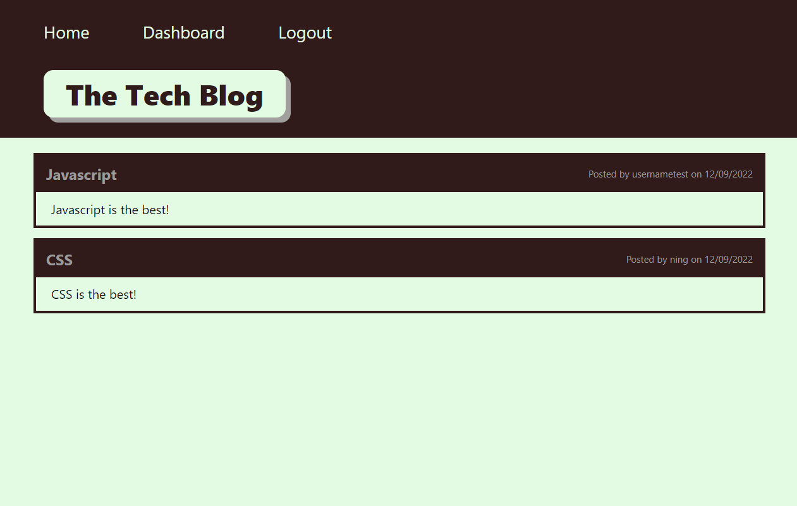
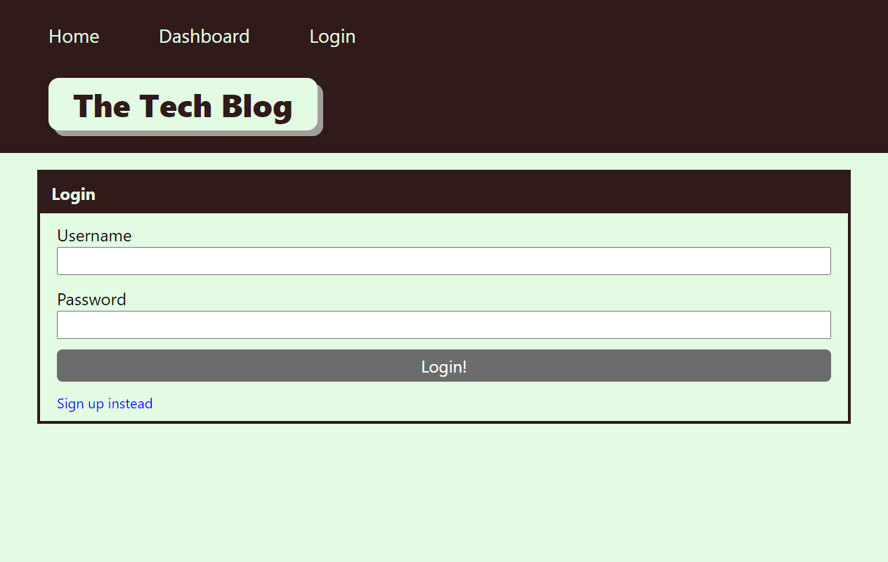
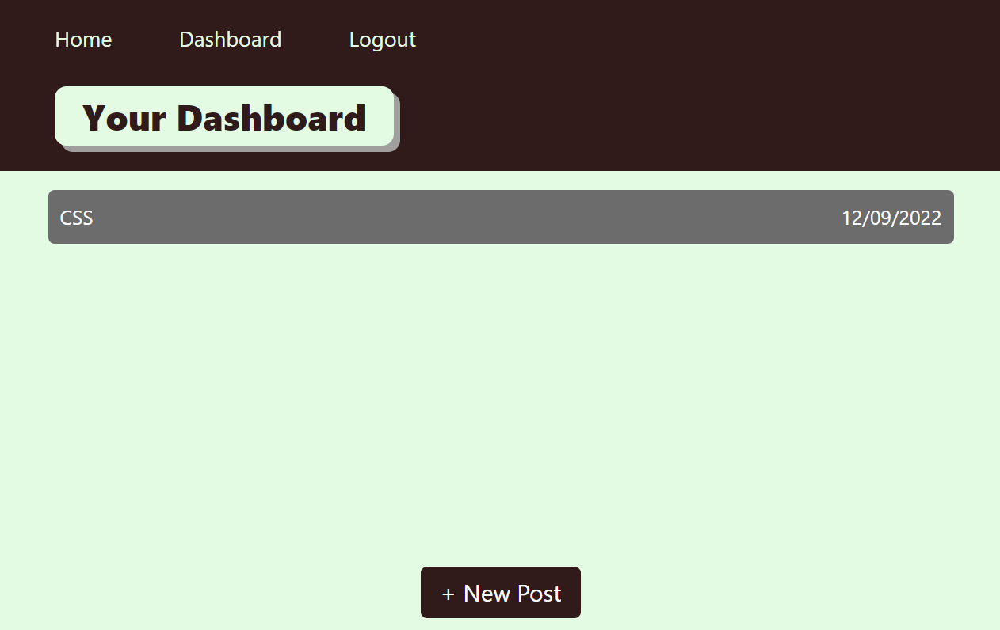
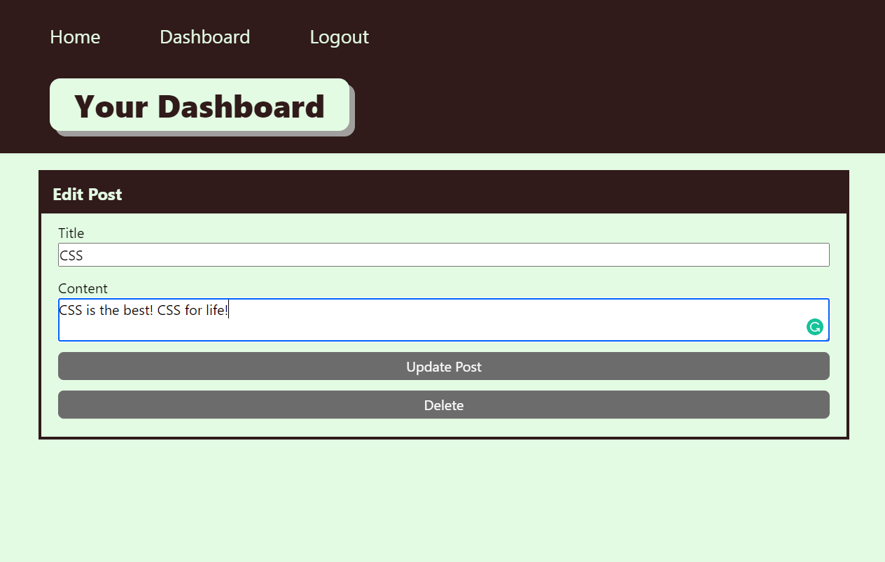
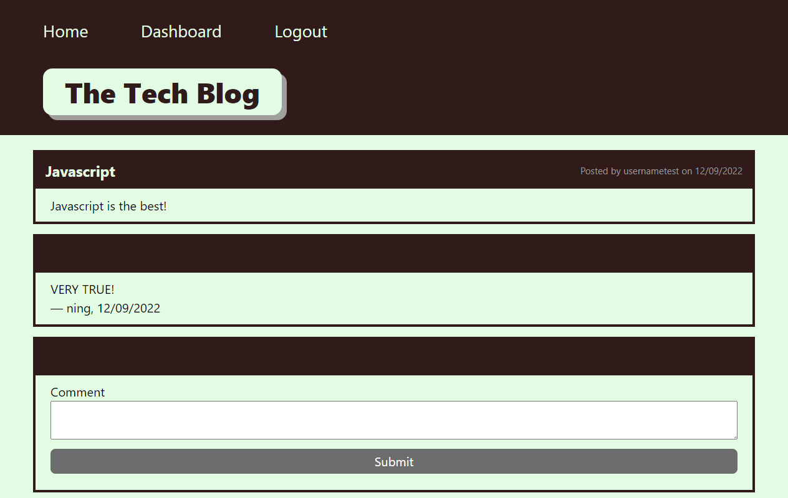

# Tech-Blog
## Description
A CMS-style blog site where developers can publish their blog posts and comment on other developers’ posts. This tech blog was buit following MVC paradigm using Handlebars.js as the templating language, Sequelize as the ORM, and the express-session npm package for authentication.<br />

GitHub repository: https://github.com/ning1604/Tech-Blog <br />
Deployed application: <br />

## Table of Contents
- [Installation](#installation)
- [Screenshots](#screenshots)
- [License](#license)
- [Contributing](#contributing)
- [Questions](#questions)

## Installation
To use the application, the repository should be cloned and node should be installed. Click on the link to be directed to guides for [cloning a respository](https://docs.github.com/en/repositories/creating-and-managing-repositories/cloning-a-repository) and [node installation](https://nodejs.org/en/download/).<br />

Open terminal and run the following command to install necessary dependencies:
```
npm i
```
Create database by running the following command and entering password when prompted.
```
mysql -u root -p
```
After password is entered, run the following commands:
```
source ./db/schema.sql
```
```
quit
```
Create .env file in main folder with your own user and password, refer to image below for assistance:<br />
<br />
To seed the database, run the following commands (or before this step, changes can be made to json files in seeds folder):
```
npm run seed
```
To run the application, in the terminal run the following command (in directory of the cloned repository).
```
npm start
```

## Screenshots
The following images shows appearance of application:<br />
Tip: refer to userData.json file for username and password to login. <br />
Homepage<br />
<br />
Login page<br />
<br />
User Dashboard<br />
<br />
Edit post page<br />
<br />
Comments page (signed in)<br />
<br />

## License
This project has no license.

## Contributing
To contribute, follow the steps under [Installation](#installation).

## Questions
For further questions about the repository, open an issue or contact me directly at [ningzhawb@gmail.com](mailto:ningzhawb@gmail.com). You can find more of my work at [ning1604](https://github.com/ning1604?tab=repositories).
